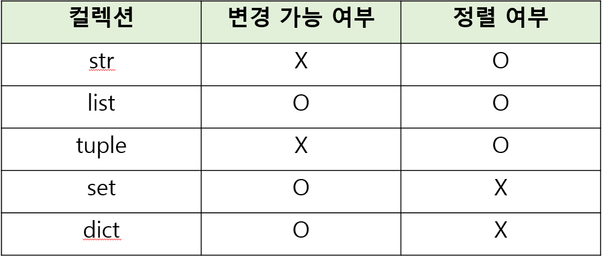

# Data Types
- Data Types : 값의 종류와 그 값에 적용 가능한 연산과 동작을 결정하는 속성

- 사칙연산, 연결, 삽입 등의 동작들이 타입에 따라 달라진다

### 데이터 타입이 필요한 이유
- 값들을 구분하고, 어떻게 다뤄야 하는지를 알 수 있음

- 요리 재료마다 특정한 도구가 필요하듯이 각 데이터 타입 값들도 각자에게 적합한 도구를 가짐

- 타입을 명시적으로 지정하면 코드를 읽는 사람이 변수의 의도를 더 쉽게 이해할 수 있고, 잘못된 데이터 타입으로 인한 오류를 미리 예방

## Numeric Types

### int (정수 자료형)
- 정수를 표현하는 자료형

#### 진수 표현
- 2진수(binary) : 0b
- 8진수(octal) : 0o
- 16진수(hexadecimal) : 0x

```
print(0b10) #2
print(0o30) #24
print(0x10) #16

# 진법 변경(10진수 -> n진수)

print(bin(12)) #2진수
print(oct(12)) #8진수
print(hex(12)) #16진수
```

### float(실수 자료형)
- 실수를 표현하는 자료형
  
- 프로그래밍 언어에서 float는 실수에 대한 <span style="color:red">'근사값'</span>

#### 유한정밀도
- 컴퓨터 메모리 용량이 한정돼 있고 한 숫자에 대해 저장하는 용량이 제한됨

- 제한된 양의 메모리에 저항할 수 있는 <span style="color:red">가장 가까운 값</span>이 출력

#### 실수 연산 시 주의사항
- 컴퓨터는 2진수를 사용, 사람은 10진법을 사용
  
- 이 때 10진수 0.1은 2진수로 표현하면 무한대로 반복된다

- 무한대 숫자를 그대로 저장할 수 없어서 사람이 사용하는 10진법의 <span style="color:red">근사값</span>만 표시

- 가장 가깝지만 동일하지 않은 값을 출력

- 이 때 Floating point rounding error가  발생할 수 있음

#### 실수 연산 시 해결책
- 두 수의 차이가 매우 작은 수보다 작은지를 확인하거나 math 모듈 활용

- 두 수의 차이가 임의 수보다 작다면 차이가 어느 정도 같다면 같은 값으로 처리

- math 모듈의 math.isclose 얼마나 가까운가(is 함수 : 결과가 T or F)

- a,b의 차이가 어느 정도 같다면 같다고 처리

#### 지수 표현 방식
- e 또는 E를 사용한 지수 표현
- 314 * 0.01 = 314e-2
- e 또는 E는 10^n을 표현

## Sequence Types
1. 순서(Sequence)<br>
값들이 순서대로 저장('정렬X')

2. 인덱싱(Indexing)<br>
- 각 값에 고유한 인덱스(번호)를 가지고 있으며, 인덱스를 사용하여 특정 위치의 값을 선택하거나 수정할 수 있음

- 0부터 시작 / 인덱싱이 있다는건 그 요소에 접근이 가능 -> 선택하고 수정할 수 있다

3. 슬라이싱(Slicing)
- 인덱스 범위를 조절해 부분적인 값을 추출할 수 있음

4. 길이(Length)
- len() 함수를 사용하여 저장된 값의 개수(길이)를 구할 수 있음

5. 반복(Iteration)
- 반복문을 사용하여 저장된 값들을 반복적으로 처리할 수 있음

### str(문자열)
- 문자들의 순서가 있는 <sep style="color:red">변경 불가능</sep>한 시퀀스 자료형
 
- 불변형 자료형

#### 문자열 표현
- 문자열은 단일 문자나 여러 문자의 조합으로 이루어짐

- 작은 따옴표(') 또는 큰따옴표(") 감싸서 표현

- Style Guide 에선 하나의 파일에서 통일해서 사용하길 권장

### 중첩 따옴표
- 따옴표 안에 따옴표를 표현할 경우

- 작은 따옴표가 들어 있는 경우는 큰따옴표로 문자열 생성

- 큰따옴표가 들어가 있는 경우는 작은 따옴표로 문자열 생성

### Escape Sequence
- 역슬래시(backslash) 뒤에 특정 문자가 와서 특수한 기능을 하는 문자 조합

- 파이썬의 일반적인 문법 규칙을 잠시 탈출한다는 의미

- \n : 줄바꿈, \t : 탭, \\\ : 백슬래시, \' : 작은 따옴표, \" : 큰 따옴표

```
print('철수야 \'안녕\'')
#철수야 '안녕'
print('이 다음은 엔터\n입니다.')
#이 다음은 엔터
#입니다.
```

### String Interpolation
- 문자열 내에 변수나 표현식을 삽입하는 방법

### f-string
- 문자열에 f 또는 F 접두어를 붙이고 표현식을 {expression}로 작성하여 문자열에 파이썬 <spe style="color:red">표현식의 값</sep>을 삽입할 수 있음

- 공간을 새로 만들어 변수 혹은 표현식을 넣겠다 (연산도 가능)

```
print('Debugging roaches 13 room')
#문자열의 고정출력

bugs = 'roaches'
counts = 13
area = 'living room'

print(f'Debugging {bugs} {counts} {area}')

#과거의 문법들

print('Debugging {} {} {}'.format(bug, counts, area))
print('Debugging %s %d %s' %(bugs, counts, area))
```

### f-string 응용(f-string advanced)
```
greeting = 'hi'
print(f'{greeting:>10}') 
# 10칸을 주고 오른쪽에 정렬하겠다

print(f'{greeting:<10}') 
# 10칸을 주고 왼쪽에 정렬하겠다

print(f'{greeting:^10}') 
# 10칸을 주고 가운데에 정렬하겠다

print(f'{3.141592:.4f}') 
# ._f 소수점 _ 자리까지 표기하겠다
```

### 문자열의 시퀀스 특징
- 인덱싱, 슬라이싱, 길이를 측정 가능

```
my_str = 'hello'

#인덱싱
print(my_str[1]) #e

#슬라이싱
print(my_str[2:4]) #ll

#길이
print(len(my_str)) #5
```

### 인덱스(index)
- 시퀀스 내의 값들에 대한 고유한 번호로, 각 값의 위치를 식별하는데 사용되는 숫자

my_str = 'hello'<br>
h e l l o<br>
0 1 2 3 4<br>
-5 -4 -3 -2 -1<br>

### 슬라이싱(slicing)
- 시퀀스의 일부분을 선택하여 추출하는 작업<br>
-> 시작 인덱스와 끝 인덱스를 지정하여 해당 범위의 값을 포함하는 새로운 시퀀스를 생성

```
my_str = 'hello'

my_str[2:4] #ll

my_str[:3] #생략은 굳이 안쓰는 것 /처음부터 슬라이싱

my_str[3:] #끝까지 슬라이싱

my_str[0:5:2] #'step' 0부터 5까지 2칸씩 점프하면서 자르겠다

my_str[::-1] #처음부터 끝까지 step이 음수 -> 방향이 반대로 'olleh'
```

- 문자열은 불변 자료형(변경 불가)

### list [리스트]
- 여러 개의 값을 순서대로 저장하는 <sep style='color:red'>변경 가능한</sep> 시퀀스 자료형

### 리스트 표현
- 0개 이상의 객체를 포함하며 데이터 목록을 저장

- 대괄호([])로 표기

- 데이터는 어떤 자료형도 저장할 수 있음

```
my_list_1 = []

my_list_2 = [1, 'a', 3, 'b', 5]

my_list_3 = [1, 2, 3, 'Python', ['hello, 'world', '!!!']]

len(ny_list_3) #5
```
- 인덱싱, 슬라이싱, 길이 측정 가능

### 중첩된 리스트 접근
```
my_list =  [1, 2, 3, 'Python', ['hello, 'world', '!!!']]

print(len(my_list)) #5
print(my_list[4][-1]) #!!!
print(my_list[-1][1][0]) #w
```
- 리스트는 가변형(변경 가능)

```
my_list = [1, 2, 3]

my_list[0] = 100

print(my_list) #[100, 2, 3]
```

### tuple(튜플)
- 여러 개의 값을 순서대로 저장하는 <sep style='color:red'>변경 불가능한</sep> 시퀀스 자료형

### 튜플 표현
- 0개 이상의 객체를 포함하며 데이터 목록을 저장

- 소괄호(())로 표기

- 데이터는 어떤 자료형도 저장할 수 있음

```
my_tuple_1 = ()

my_tuple_2 = (1,)
#튜플의 요소가 한개라면 반드시 ,를 작성해야함

my_tuple_3 = (1, 'a', 3, 'b', 5)
#인덱싱, 슬라이싱, 길이 측정 가능
```
- 튜플은 불변 (변경 불가)

### 튜플은 어디에 쓰일까?
- 튜플은 불변 특성을 사용한 안전하게 여러 개의 값을 전달, 그룹화, 다중할당 등

- 개발자가 직접 사용하기 보다 <sep style='color:red'>파이썬 내부동작</sep>에서 주로 사용됨

- 파이썬은 쉼표를 튜플 생성자로 사용하니 괄호는 생략 가능

- x, y = 10, 20 (튜플)

### range
- 연속된 정수 시퀀스를 생성하는 <sep style='color:red'>변경 불가능</sep>한 자료형

### range 표현
- range(n)

- 0부터 n-1까지의 숫자의 시퀀스 (0부터 카운팅 하기 때문)

- range(n, m)<br>
  n부터 m-1 까지의 숫자 시퀀스

```
my_range_1 = range(5)
my_range_2 = range(1, 10)

print(my_range_1) # range(0, 5)
print(my_range_2) # range(1, 10)
```
- 주로 반복문과 함께 사용 예정

## Non-sequence Types

## dict(딕셔너리)
- key-value 쌍으로 이루어진 순서와 중복이 없는 <sep style='color:red'>변경 가능</sep>한 자료형

### 딕셔너리 표현
- key는 변경 불가능한 자료형만 사용가능 (str, int, float, tuple, range ...)

- value는 모든 자료형 사용가능

- 중괄호({})로 표기

### 딕셔너리 사용
- key를 통해 value에 접근
```
my_dict = {'apple' : 12, 'list' : [1, 2, 3]}

print(my_dict['apple']) #12
print(my_dict['list']) #[1, 2, 3]

# 값 변경
my_dict['apple'] = 100
print(my_dict) # {'apple' : 100, 'list' : [1, 2, 3]}
```

## set(세트)
- 순서와 중복이 없는 <sep style='color:red'>변경 가능</sep>한 자료형

### 세트 표현
- 수학에서의 집합과 동일한 연산 처리 가능

- 중괄호({})로 표기

- 집합 연산에서 주로 사용됨

```
my_set_1 = set() #빈 딕셔너리는 my_dict = {}
my_set_2 = {1, 2, 3}
my_set_3 = {1, 1, 1}

print(my_set_1) #set()
print(my_set_2) #{1, 2, 3}
print(my_set_3) #{1} #중복 없이 다 쳐냄
```

### 세트 집합 연산
```
my_set_1 = {1, 2, 3}
my_set_2 = {3, 6, 9}

#합집합
print(my_set_1 | my_set_2) # {1, 2, 3, 6, 9} 중복없이 # | 파이프 라인
print(my_set_1 - my_set_2) # {1,2}
print(my_set_1 & my_set_2) # {3}
```

## None
- 파이썬에서 <sep style='color:red'>값이 없음</sep>을 표현하는 자료형

```
variable - None
print(variable) #None
```

## Boolean
- 참(True)과 거짓(False)을 표현하는 자료형

### 불리언 표현
- 비교 / 논리 연산의 평가 결과로 사용됨

- 주로 조건 / 반복문과 함께 사용

## Collection
- 여러개의 항목 또는 요소를 담는 자료 구조

- str, list, tuple, set, dict



### 불변과 가변의 차이

```
my_str = 'hello'
my_str[0] = 'z'
TypeError : 'str; object does not support item assignment
```
- 문자열은 문자 통째로 메모리에 들어갔기 때문에 변경을 할 수 없다

- 문자열은 새로운 문자열은 생성하는 수 밖에 없다

```
my_list = [1, 2, 3]
my_list[0] = 100

print(my_list) #[100, 2, 3]
```
- 리스트는 객체들의 참조만을 모아놓은 collection

```
list_1 = [1, 2, 3]
list_2 = list_1

list_1[0] = 100
print(list_1) # [100, 2, 3]
print(list_2) # [100, 2, 3]
# 메모리 주소가 할당 되었기 때문에 list_2를 터치하지 않았지만 변경 된다

x = 10
y = x

x = 20
print(x) # 20
print(y) # 10
```