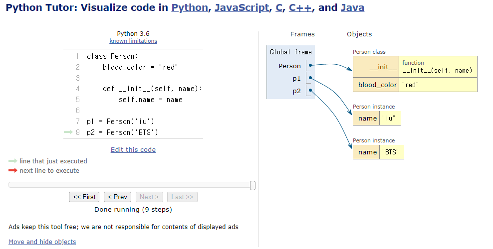
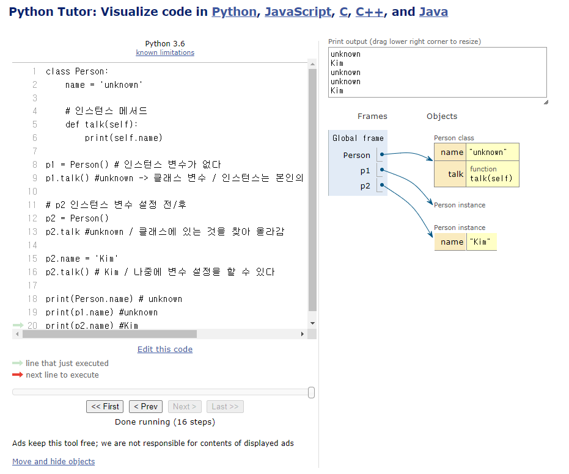

# Classes

## 객체지향 프로그래밍

### 절차 지향 프로그래밍(Procedural Programming)

- "데이터"와 해당 데이터를 처리하는 "함수(절차)"가 분리되어 있으며, '함수 호출의 흐름'이 중요

- 코드의 순차적인 흐름과 함수 호출에 의해 프로그램이 진행

- 실제로 실행되는 내용이 무엇이 무엇인가가 중요

- 데이터를 다시 재사용하거나 하기보다는 처음부터 끝까지 실행되는 결과물

- 함수가 처음부터 끝까지 실행되는 것이 더 중요

### 소프트웨어 위기 (Software Crisis)

- 하드웨어의 발전으로 컴퓨터 계산용량과 문제의 복잡성이 급격히 증가함에 따라 소프트웨어에 발생한 충격

- 컴퓨터가 여러 프로그램이 동작할 때 함수 호출 순서가 관리하기에 너무 복잡해짐

- 단점을 보완하기 위해 데이터 중심으로 관점을 바꾸기 시작

### 객체 지향 프로그래밍 (Object Oriented Programming)

- 데이터와 해당 데이터를 조작하는 '메서드'를 하나의 객체로 묶어 관리하는 방식의 프로그래밍 패러 다임

- 데이터와 그 데이터를 조작하는 메서드를 하나로 묶음

- 메서드는 객체에 '속한' 함수

- 절차지향은 함수가 스스로 순서를 정하는 중요한 역할을 수행

- 객체 지향은 함수의 역할을 축소 시키고 데이터 중심으로 관점 변경

### 절차지향 vs 객체 지향
#### 절차 지향

- 데이터와 해당 데이터를 처리하는 함수(절차)가 분리

- 함수 호출의 흐름이 중요

- 함수가 데이터를 받음 함수(데이터)

#### 객체 지향

- 데이터와 해당 데이터를 처리하는 메서드(메세지)를 하나의 객체(클래스)로 묶음

- 객체 간 상호작용 메시지 전달이 중요

- 데이터(객체)가 메서드를 호출한다

- 클래스는 부모 클래스로부터 자식 클래스를 만들 수 있다 (상속)

## 객체

### 클래스 (Class)
- 파이썬에서 '타입'을 표현하는 방법

- 객체를 생성하기 위한 설계도 (blueprint)

- 데이터와 기능을 함께 묶는 방법을 제공

### 객체 (Object)
- 클래스에서 정의한 것을 토대로 메모리에 할당된 것

- '속성'과 '행동'(기능)으로 구성된 모든 것

- 파이썬에선 모든 것을 객체라고 할 수 있다

### 클래스와 객체
- ex) 가수(클래스) -> 객체 (아이유, BTS, ...) (노래() method)

- 클래스로 만든 객체를 '인스턴스' 라고도 함

- ex) 아이유는 객체다(O) / 아이유는 인스턴스다(X) / 아이유는 가수의 인스턴스다(O)

- 클래스를 만든다 == '타입'을 만든다

```python
name = 'Alice'
print(type(name)) # <class 'str'>

# 변수 name의 타입은 str 클래스다.
# 변수 name은 'str클래스의 인스턴스'이다.
# 우리가 사용해왔던 '데이터 타입은 사실 모두 클래스' 였다.

str(1) # '1'

# 문자열 타입을 만들어냄
# '1'은 문자열(str) 클래스의 인스턴스

# 결국 문자열 타입의 변수는 str클래스로 만든 인스턴스다.

print(help(str))

"""
class str(object)
 |  str(object='') -> str
 |  str(bytes_or_buffer[, encoding[, errors]]) -> str
 |  
 |  "Create a new string object from the given object." If encoding or
 |  errors is specified, then the object must expose a data buffer
 |  that will be decoded using the given encoding and error handler.
 |  Otherwise...
 """
 ```

 - '', 'hello', '파이썬' <br>
  문자열 타입(클래스)의 객체(인스턴스)

- [1, 2, 3], [1], [], ['hi'] <br>
  리스트 타입(클래스)의 객체(인스턴스)

### 인스턴스와 메서드
- "hello".upper() <br>
  문자열.대문자로() <br>
  객체.행동() <br>
  "인스턴스.메서드()" <br>
  객체가 중심 -> 객체 지향

- [1, 2, 3].sort() <br>
  리스트.정렬해() <br>
  객체.행동() <br>
  "인스턴스.메서드()"

- 하나의 객체(object)는 특정 타입의 인스턴스(instance) 이다

- 123, 900, 5는 모두 int의 인스턴스

- 'hello', 'bye'는 모두 string의 인스턴스

- [232, 89, 1]은 모두 list의 인스턴스


### 객체(object)의 특징
- 타입(type) : 어떤 연산자(operator)와 조작(method)이 가능한가?

- 속성(attribute) : 어떤 상대(데이터)를 가지는가?

- 조작법(method) : 어떤 행위(함수)를 할 수 있는가?

- 객체(Object) : 속성(Attribute) + 기능(Method)의 결과다

## 클래스
- 파이썬에서 타입을 표현하는 방법

- 객체를 생성하기 위한 설계도 (blueprint)

- 데이터와 기능을 함께 묶는 방법을 제공

### 클래스 구조

- 클래스 정의 <br>
  class Person:
    pass

- 인스턴스 생성 <br>
  iu = Person()

- 메서드 호출 <br>
  iu.메서드()

- 속성(변수)접근 <br>
  iu.attribute

- 행동은 인스턴스가 주도

## 클래스 기본 활용

### 클래스 정의
- 클래스는 파스칼 케이스를 사용

```python
class Person:
    # 속성(변수)
    blood_color = "red"

    # 메서드
    def __init__(self, name)
    # __method__ : 매직 메서드 / 개발자가 직접 호출 x / 기능상 자연스럽게 동작
    # init 초기화 하고 시작한다 / ex) git init
    # 생성자 메서드
    # 인스턴스를 생성할 때 자동으로 호출이 된다 / 개발자가 직접 호출 x
        self.name = name
    
    def singing(self):
        return f'{self.name}가 노래합니다.'

# 인스턴스 생성
singer1 = Person('iu')
# 인자가 필요하다 / name 이라는 위치인자가 존재하기 때문에 값을 넣어줘야 한다
singer2 = Person('BTS')
# BTS가 노래합니다. 인스턴스가 가진 변수들이 각각 독립적으로

# 속성(변수) 접근
print(singer1.blood_color)
print(singer2.blood_color)

# 둘 다 같은 클래스를 참조했기 떄문에 'red' 출력
# 서로의 name은 각자 출력
# name은 클래스에서 정의되지 않았음
```


## 클래스 기본 활용

### 생성자 함수

- 객체를 생성할 때 자동으로 호출되는 특별한 메서드

- __init__ 이라는 이름의 메서드로 정의되며, 객체의 초기화를 담당

- 생성자 함수를 통해 인스턴스를 생성하고 필요한 초기값을 설정 / 초기값을 줄 수도 있고 안줄 수도 있음

def __init__(self, name): <br>
&nbsp;&nbsp;&nbsp;&nbsp;self.name = nmae

### 인스턴스 변수
- 인스턴스(객체)마다 별도로 유지되는 변수
  
- 인스턴스마다 독립적인 값을 가지며, 인스턴스가 생성될 때마다 초기화됨

def __init__(self, name): <br>
&nbsp;&nbsp;&nbsp;&nbsp;sefl.name = name

### 클래스 변수
- 클래스 내부에 선언된 변수

- 클래스로 생성된 모든 인스턴스들이 공유하는 변수

class Person: <br>
&nbsp;&nbsp;&nbsp;&nbsp;blood_color = 'red'

### 인스턴스 메서드
- 각각의 인스턴스에서 호출할 수 있는 메서드

- 인스턴스 변수에 접근하고 수정하는 등의 작업을 수행
  
def singing(sefl): <br>
&nbsp;&nbsp;&nbsp;&nbsp;return f'{self.name}가 노래합니다.'

### 인스턴스와 클래스 간의 이름 공간(namespace)

- 클래스를 정의하면, 클래스와 해당하는 이름 공간 생성

- 인스턴스를 만들면, 인스턴스 객체가 생성되고 '독립적인' 이름 공간 생성

- 인스턴스에서 특정 속성에 접근하면, 인스턴스 -> 클래스 순으로 탐색

- 인스턴스 별 이름 공간

```python
# 예시 코드

# Person 정의
class Person:
    name = 'unknown'

    # 인스턴스 메서드
    def talk(self):
        print(self.name)

    p1 = Person() # 인스턴스 변수가 없다
    p1.talk() #unknown -> 클래스 변수 / 인스턴스는 본인의 변수가 없다면 클래스로 찾아 나간다

    p2.name = 'Kim'
    p2.talk() # Kim / 나중에 변수 설정을 할 수 있다

    print(Person.name) # unknown
    print(p1.name) #unknown
    print(p2.name) #Kim
```


```python
p1.address = 'KOREA'
# 인스턴스 변수 이기 때문에 클래스의 관여 대상이 아님
# 인스턴스 변수는 각자 지가 알아서 만들고 사용하는 것임

print(p1.address) # KOREA
```

### 독립적인 이름공간을 가지는 이점
- 각 인스턴스는 독립적인 메모리 공간을 가지며, 클래스와 다른 인스턴스 간에는 서로의 데이터나 상태에 직접적인 접근이 불가능

- 각 인스턴스 끼리의 독립적인 동작을 보장한다

- 객체 지향 프로그래밍의 중요한 특성 중 하나로, 클래스와 인스턴스를 모듈화하고 각각의 객체가 독립적으로 동작하도록 보장

- 이를 통해 클래스와 인스턴스는 다른 객체들과의 상호작용에서 서로 충돌이나 영향을 주지 않으면서 독립적으로 동작할 수 있음

- 코드의 가독성, 유지보수성, 재사용성을 높이는데 도움을 줌

### 클래스 변수 활용
```python
# 기수가 몇병인지 확인하고 싶다면?
# 인스턴스가 생성될 때마다 클래스 변수가 늘어나도록 설정할 수 있음

class Person:
    count = 0

    def __init__(self, name):
        self.name = name
        Person.count += 1
        #생성자 함수에서 생성이 될 때 마다 count 상승
    
    person1 = Person('iu')
    person2 = Person('BTS')

    print(Person.count) #2
```

### 클래스 변수와 인스턴스 변수
- 클래스 변수를 변경할 때는 항상 '클래스.클래스변수' 형식으로 변경

```python
class Circle():
    pi = 3.14

    def __init__(self, r):
        self.r = r

c1 = Circle(5)
c2 = Circle(10)

print(Circle.pi) # 3.14
print(c1.pi) # 3.14
print(c2.pi) # 3.14

Circle.pi = 5 # 클래스 변수 변경
print(Circle.pi) # 5
print(c1.pi) # 5
print(c2.pi) # 5

c2.pi = 5 # 인스턴스 변수 변경
print(Circle.pi) # 3.14 (클래스 변수)
print(c1.pi) # 3.14 (클래스 변수)
print(c2.pi) # 5 (새로운 인스턴스 변수)
```
- 클래스가 사용할 수 있게 코드를 짜야함

## 메서드

### 메서드 종류
- 인스턴스 메서드 -> 인스턴스.메서드 / 인스턴스가 쓰기 때문에 인스턴스 메서드

- 클래스 메서드 -> 클래스.메서드 / 클래스가 쓰기 때문에 클래스 메서드

- 대부분 인스턴스가 동작 하지만 클래스도 자신만의 동작을 하는 경우가 있음

- 정적 메서드(static method)

### 인스턴스 메서드 instance method
- 클래스로부터 생성된 각 인스턴스에서 호출할 수 있는 메서드

- 인스턴스의 상태를 조작하거나 동작을 수행

### 인스턴스 메서드 구조
- 클래스 내부에 정의되는 메서드의 기본

- 반드시 첫 번째 매개변수로 '인스턴스 자신(self)'을 전달 받음

```python
"""
class MyClass:

    def instance_method(self, arg1, ...):
        pass
    # 단지 함수 일뿐 매개변수 이름은 아무거나 상관이 없다
    # self로 하는 이유는 단지 파이썬의 암묵적인 약속
    # 쓸 수 있지만 쓰지 않는다
"""
```
```python
# 인스턴스.메서드()
'abc',upper() # 클래스.메서드의 축약형 느낌

# 클래스.메서드(인스턴스 자기자신)
str.upper('abc')
# 데이터가 무언가의 인자로서만 들어감
# self를 정의하지 않으면 인스턴스 메서드는 동작하지 않음

# self 동작 원리
# upper 메서드를 사용해 문자열 'hello'를 대문자로 변경하기;
'hello'.upper()

# 하지만 실제 파이썬 내부 동작은 다음과 같이 이루어진다
str.upper('hello')

# str 클래스가 upper 메서드를 호출했고, 그 첫번째 인자로 문자열 인스턴스가 들어간 것이다.
# "인스턴스 메서드의 첫번째 매개변수가 반드시 인스턴스 자기 자신인 이유"

# 'hello.upper()은 str.upper('hello')를
# 객체 지향 방식의 메서드로 호출하는 표현이다. (단축형 호출)

# 'hello' 라는 문자열 객체가 단순히 어딘가의 함수로 들어가는 인자가 아닌
# 객체 스스로 메서드를 호출하여 코드를 동작하는 객체 지향적 표현이다.

# 생성자 메서드 constructor method
# 인스턴스 객체가 생성될 때 자동으로 호출되는 메서드
# 인스턴스 변수들의 초기값을 설정
```

### 클래스 메서드 (class method)
- 클래스가 호출하는 메서드

- 클래스 변수를 조작하거나 클래스 레벨의 동작을 수행

### 클래스 메서드 구조
- @classmethod 데코레이터를 사용하여 정의

- 호출 시, 첫번째 인자로 호출하는 클래스(cls)가 전달됨

```python
"""
class MyClass:

    @classmethod
    def class_method(cls, arg1, ...):
        # 클래스 메서드를 호출하는 인자로 클래스(cls)가 들어감
        pass
"""
```

- ex) 클래스 변수 수정의 경우

- cls.변수 = '' / 본인의 변수가 있기 때문에 조작하기가 편해짐

- @classmethod -> 데코레이터 / 데코레이터 덕에 클래스 메서드가 될 수 있음

### @classmethod 데코레이터를 사용하여 정의
- 호출 시, 첫번째 인자로 호출하는 클래스(cls)가 전달됨

```python
#클래스 메서드 예시

class Person:
    count = 0

    def __init__(self, name):
        Person.count += 1

    @classmethod
    def number_of_population(cls):
        print(f'인구수는 {cls.count}입니다.')
        # cls는 class 그 자체

person1 = Person('iu')
person2 = Person('BTS')

Person.number_of_population() # 인구수는 2 입니다.
```

### 스태틱 메서드
- 스태틱(정적) 메서드 static method

- 클래스와 인스턴스와 상관없이 독립적으로 동작하는 메서드

- 주로 클래스와 관련이 잇지만 인스턴스와 상호작용이 필요하지 않은 경우에 사용

### 스태틱 메서드 구조
- @staticmethod 데코레이터를 사용하여 정의

- 호출 시 필수적으로 작성해야 할 매개변수가 없음

- 즉, "객체 상태나 클래스 상태를 수정할 수 없으며" 단지 기능(행동)만을 위한 메서드 사용

```python
class Myclass:

    @staticmethod
    def static_method(arg1):
        pass

# 스테틱 메서드 예시
class StringUtils:
    @staticmethod
    def reverse_string(string):
        return string[::-1]

    @stacticmethod
    def capitalize_string(string):
        return string.capitalalize()

text = 'hello, world'

reversed_text = StringUtils.reverse_string(text)
print(reversed_text) # dlrow ,olleh

capitalized_text = StirngUtils.capitalize_string(text)
print(capitalized_text) # Hello, world
```

### 메서드 정리

#### 인스턴스 메서드

- 인스턴스의 상태를 변경하거나, 해당 인스턴스의 특정 동작을 수행

#### 클래스 메서드

- 인스턴스의 상태를 변경하거나, 해당 인스턴스의 특정 동작을 수행

#### 스태틱 메서드
  
- 클래스 및 인스턴스와 관련이 없는 일반적인 기능을 수행

#### 각자의 역할
- 클래스가 사용해야 할 것 : 클래스 메서드 / 스태틱 메서드

#### 인스턴스가 사용해야 할 것
- 인스턴스 메서드

- 인스턴스는 클래스 메서드 / 스태틱 메서드 모두 호출은 기능상 가능

```python
class Myclass:
    def instance_method(self):
        return 'instance_method', self

    @classmethod
    def class_method(cls):
        return 'class_method', cls

    @staticmethod
    def static_method():
        return 'static_method'

# 클래스가 할 수 있는 것
# 클래스는 모든 메서드를 호출 할 수 있음
# "하지만 클래스는 클래스 메서드와 스태틱 메서드만 사용하도록 한다"

instance = MyClass()

print(MyClass.instance_method(instance))
print(Myclass.class_method())
print(Myclass.static_method())

# 인스턴스가 할 수 있는 것
# 인스턴스는 모든 메서드를 호출 할 수 있음
# "하지만 인스턴스는 인스턴스 메서드만 사용하도록 한다"
# 나중에 유지보수를 할 수 없어진다

instance = MyClass()

print(instance.instance_method(instance))
print(instance.class_method())
print(instance.static_method())
```
- 할 수 있다 != 써도 된다

- 각자의 메서드는 OOP 패러다임에 따라 명확한 목적에 따라 설계된 것이기 때문에

- 클래스와 인스턴스 각각 올바른 메서드만 사용하도록 해야 한다


## 참고

### 매직 메서드
- 특별한 인스턴스 메서드

- "특정 상황에 자동으로 호출되는 메서드"

- Double underscore(__)가 있는 메서드는 특수한 동작을 위해 만들어진 메서드

- 스페셜 메서드 혹은 매직 메서드라고 불림

- __str__(self) print 했을 때 출력 값을 바꿔주는 매직 메서드

### 데코레이터(Decorator)
- 다른 함수의 코드를 유지한 채로 수정하거나 확장하기 위해 사용되는 함수

### 절차지향과 객체지향
- 절차 지향과 객체 지향은 대조되는 개념이 아니다

- 객체 지향은 기존 절차 지향을 기반으로 두고 보완하기 위해

- 객체라는 개념을 도입해 상속, 코드재사용성, 유지보수성 등의 이점을 가지는 패러다임
